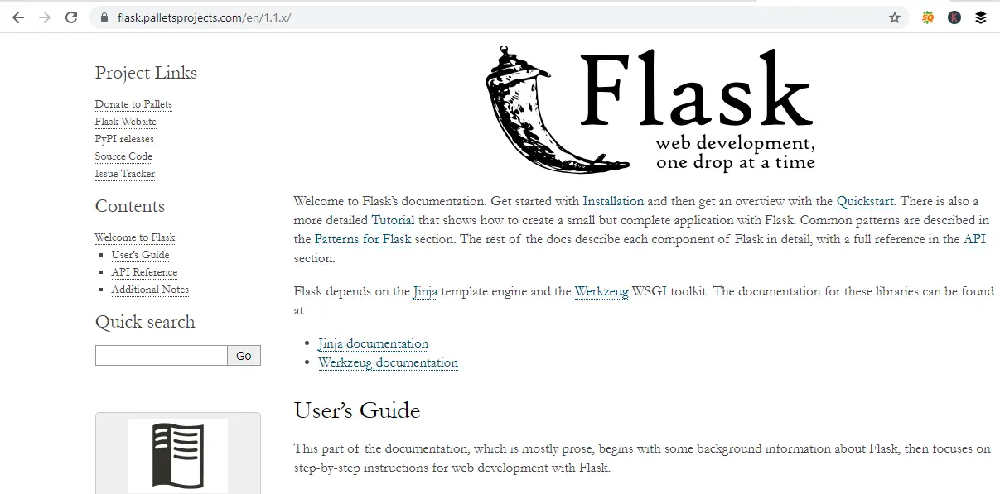

# Ejemplos de Python y Flask
### NIVEL 3


- uno
- dos
````
input()

## PRIMERO
````python
````
Un método es una **función** que «pertenece a» un objeto ...
LOS ENLACES
| 1    | 2    | 3    |
| :--- | :--- | :--- |
|alt|mayu|f|